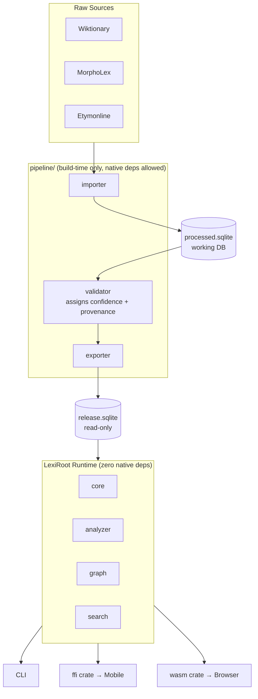

---
tags:
  - nativee
created: 2026-07-02 10:41
---
# LexiRoot

> **Understand English from its roots.**
>
> **The open-source morphology engine for English.**
>
> *The SQLite of English morphology.*

LexiRoot is an open-source Rust library and offline database for English morphology.

Instead of treating words as isolated dictionary entries, LexiRoot models English as a structured knowledge graph of **morphemes**, **etymology**, and **word relationships**.

It enables applications to answer questions like:

- Why is **inspection** spelled this way?
- Which words share the same Latin root?
- What does the prefix **trans-** contribute?
- Which words belong to the same word family?
- How did this word evolve through history?

Whether you're building a dictionary, an AI assistant, an IELTS learning app, or an NLP pipeline, LexiRoot provides a fast, embeddable, offline-first foundation.

---

## Why LexiRoot?

Most dictionaries are designed for humans.

Most NLP datasets are designed for machines.

LexiRoot is designed for **both**.

It combines linguistic knowledge, structured data, and high-performance Rust APIs into a single reusable foundation.

---

## What Makes LexiRoot Different?

| Traditional Dictionary | LexiRoot |
|------------------------|----------|
| Defines words | Explains how words are built |
| Lookup by word | Lookup by word, root, prefix, suffix, origin |
| Flat entries | Connected knowledge graph |
| Human-readable | Human & machine-readable |
| Online services | Offline-first Rust library |
| Closed ecosystem | Open-source infrastructure |

---

## Core Capabilities

- 🧩 Morpheme analysis (prefix / root / suffix)
- 🌍 Etymology tracing
- 🌳 Word family exploration
- 🕸 Relationship graph traversal
- ⚡ Offline, zero-network runtime
- 📦 Embeddable Rust library
- 📱 Mobile-ready (iOS / Android / Flutter)
- 🌐 WebAssembly support
- 🔍 Fast local search
- 📚 Source-backed linguistic data


---

## Vision

Most existing English dictionaries answer questions like:

> What does this word mean?

LexiRoot aims to answer deeper questions:

- How is this word constructed?
- Which morphemes does it contain?
- What other words share the same root?
- Where did this word originate?
- How are thousands of English words connected?

Instead of treating English as a collection of isolated words, LexiRoot models it as a connected graph.

---

## Features

### Morphological Analysis

```text
transportation

trans- + port + -ation
```

```rust
let analysis = db.analyze("transportation")?;

println!("{:#?}", analysis);
```

Output:

```text
Word: transportation

Prefix:
  trans = across

Root:
  port = carry

Suffix:
  ation = process or result
```

---

### Spelling Changes at Morpheme Boundaries

English rewrites the stem when it attaches an affix. `believe` + `-able` is
spelled `believable`, `happy` + `-ness` is `happiness`, `run` + `-ing` is
`running`. A segmenter that tiles a word with literal substrings finds nothing
in any of them: the letters sitting in the root slot (`believ`, `happi`,
`runn`) are not the letters the morpheme table holds.

LexiRoot handles this in two places, split by whether a rule can predict the
change:

| | mechanism | where | examples |
|---|---|---|---|
| **Regular** | derived by rule | `analyzer::ortho` | silent-e deletion, consonant doubling, `y` → `i` |
| **Irregular** | listed per morpheme | `Morpheme::variants` | `admit` ~ `admiss`, `receive` ~ `recept` |

The split matters. Regular changes are *productive* — they apply to stems the
database has never seen — so listing them per stem would mean three or four
dead rows each and would still miss anything new. Irregular alternation is not
predictable from spelling at all, so no rule reaches it and it has to be
written down.

```text
unbelievable

un- + believe + -able      # root slot reads "believ"; silent-e restored
```

Segments are always reported under the **canonical** morpheme id, never the
surface spelling, so every id in a decomposition resolves in the morpheme
table:

```rust
db.analyze("unhappiness")?;   // un : prefix, happy : root, ness : suffix
db.analyze("admission")?;     // admit : root, ion : suffix
```

---

### Root Lookup

```rust
let root = db.root("spect")?;
```

Output:

```text
spect

Meaning:
  look
  see

Origin:
  Latin specere

Related words:

inspect
respect
prospect
spectator
perspective
retrospective
```

---

### Word Family

```rust
db.family("act")
```

```text
act
├── action
├── active
├── activity
├── actor
├── react
├── interact
└── deactivate
```

---

### Etymology

```rust
db.etymology("television")
```

```text
tele
Greek
↓

vision
Latin
↓

television
English
```

---

### Relationship Graph

```text
          spect
         /  |   \
        /   |    \
 inspect  respect  spectator
        \
         perspective
```

Relationship traversal runs as SQL recursive queries against the release SQLite file, not a fully materialized in-memory graph. This keeps runtime memory footprint low, which matters on mobile targets.

---

## Design Goals

LexiRoot is built around several core principles.

### Offline First

No Internet connection is required.

Everything runs locally.

---

### Embeddable

Designed to run inside:

- iOS
- Android
- Flutter
- Tauri
- Desktop
- CLI
- WebAssembly

Runtime crates (`core`, `analyzer`, `graph`, `search`) carry zero native dependencies, so they cross-compile cleanly to `wasm32-unknown-unknown` and mobile targets (`aarch64-apple-ios`, `aarch64-linux-android`, etc). Anything that needs a native dependency (e.g. a Postgres or filesystem client) lives only in the build-time `pipeline/` crates and never gets linked into the runtime.

---

### Source Driven

Every piece of data should be traceable back to reliable sources.

Currently loaded:

| source | what it supplies |
|---|---|
| `colingoldberg-morphemes` | Greek/Latin bound roots and affixes (primary) |
| `withenglishwecan-roots` | Greek/Latin roots (secondary; merged, primary wins on conflict) |
| `lexiroot-stems` | **ours** — native free stems and irregular allomorphs |

The third exists because the first two are *bound-root* dictionaries. They are
good at `spect`, `port` and `struct` — forms that never stand alone as words —
and contain essentially none of the Germanic core of English. The consequence
was total rather than partial: `believe`, `help`, `friend` and `break` were all
absent, so nothing built on them could be segmented at all, however good the
algorithm. See `data/raw/lexiroot-stems/README.md` for the curation rules.

Planned:

- Wiktionary
- MorphoLex
- Etymonline
- Open linguistic datasets

---

### Explainable

Every analysis should include:

- confidence score
- supporting evidence
- source references

No "black-box" AI results.

These three fields are modeled as a `Provenance` struct in `core`, attached to every `Morpheme`, `Root`, and `Relationship` record. It is a first-class part of the schema, not metadata bolted on later.

---

### Immutable Releases

The runtime database is read-only.

All data generation happens offline through reproducible pipelines.

The `pipeline/` crates (`importer`, `validator`, `exporter`) are build-time only binaries, never linked into the runtime. Reproducibility comes from pinning raw source snapshots (fixed Wiktionary/MorphoLex/Etymonline dump versions) and deterministic ordering in the exporter, so the same input always produces a byte-identical release SQLite file.

---

## Architecture



---

## Project Structure

```text
lexiroot/

├── crates/
│   ├── core/          # domain model + Provenance, zero native deps
│   ├── analyzer/      # runtime morphological analysis (was "parser")
│   ├── graph/          # relationship traversal via SQL recursive queries
│   ├── search/         # fast local search/index
│   ├── ffi/             # mobile bindings (iOS / Android / Flutter)
│   ├── wasm/           # WebAssembly bindings, split from ffi (different target constraints)
│   ├── store/          # release SQLite → in-memory AnalyzerDb (native dep, host-side only)
│   ├── cli/
│   ├── web/            # local test page + JSON API over the analyzer (dev tool)
│   │
│   └── pipeline/       # build-time only, never linked into runtime
│       ├── importer/    # parses raw sources into structured records
│       ├── validator/   # cross-checks records, assigns confidence + provenance
│       └── exporter/    # writes validated records to release SQLite
│
├── data/
│   ├── raw/
│   │   ├── colingoldberg-morphemes/  # upstream: Greek/Latin bound roots
│   │   ├── withenglishwecan-roots/   # upstream: Greek/Latin roots
│   │   └── lexiroot-stems/           # ours: native free stems + irregular allomorphs
│   ├── gold/               # hand-checked segmentations; the segmenter's regression set
│   ├── processed.sqlite   # working DB (SQLite, same format family as release)
│   └── release/            # read-only release SQLite files
│
├── docs/
└── examples/
```

`core` / `analyzer` / `graph` / `search` never depend on `pipeline/*` — the boundary is enforced by the workspace dependency graph, not just convention, so a runtime crate can never accidentally pull in a native dependency and break the WASM/mobile build.

---

## Example

```rust
use lexiroot::Database;

fn main() -> Result<(), Box<dyn std::error::Error>> {
    let db = Database::open("lexiroot.db")?;

    let result = db.analyze("inspection")?;

    println!("{:#?}", result);

    Ok(())
}
```

---

## 本地测试页面

`crates/web` 是一个开发期工具：把 release 数据库加载进内存，起一个本地 HTTP 服务，提供一个网页用来试分词结果。

```bash
cargo run -p lexiroot-web
# LexiRoot test page: http://127.0.0.1:8080  (db: data/release/lexiroot-v0.1.sqlite)
```

可选参数：`--db <path>`、`--host <addr>`、`--port <port>`。

页面支持三种查询（与 CLI 的 `analyze` / `root` / `family` 走同一条查询路径），查询状态写进 URL（`?mode=analyze&q=inspection`），可直接分享或刷新复现。

同样的三个接口也可以直接用 curl 调：

```bash
curl 'http://127.0.0.1:8080/api/analyze?word=inspection'
curl 'http://127.0.0.1:8080/api/root?text=spect'
curl 'http://127.0.0.1:8080/api/family?text=port'
```

服务端只用 `std`（无 HTTP 框架依赖），默认只监听 loopback：没有鉴权、限流和 TLS，只用于本地测试，不要对外暴露。

---

## Future Roadmap

### v0.1

- English word database
- Prefix database
- Suffix database
- Root database
- Morphology parser
- SQLite export

---

### v0.2

- Word family graph
- Etymology graph
- Confidence scoring
- CLI

---

### v0.3

- FFI
- Swift package
- Kotlin bindings
- Flutter bindings

---

### v0.4

- WebAssembly
- Browser support
- Incremental updates

---

### v1.0

- Stable Rust API
- Offline binary database
- High-performance search engine
- Complete documentation

---

## Philosophy

LexiRoot is **not** another English dictionary.

It is an open, programmable knowledge base for English morphology.

The goal is to provide a reliable foundation that developers can build upon, enabling a new generation of language learning tools, AI assistants, and linguistic applications.

---

## License

MIT

---

## 早期评审（2026-07-02，项目尚未启动）

### 架构师视角

- 数据流水线（Raw Sources → Import/Validation → PostgreSQL 开发态 → SQLite/Binary 发布态 → Runtime）思路合理，crate 拆分符合 Rust workspace 惯例。
- **待确认风险**：Wiktionary / MorphoLex / Etymonline 的数据许可证差异很大，能否合法打包分发到"immutable release"需要在动工前确认，否则可能卡死 v1.0。（仍未解决，需项目启动前查清楚）
- ~~发布数据库缺版本 / 迁移策略~~ → 已改为全程只用 SQLite（开发态 `processed.sqlite`、发布态 `release/`），去掉 Postgres 这一层，减少一套 schema 维护和一个外部依赖。
- v0.1 就铺开 9 个 crate 偏重，建议先用 core + cli 跑通最小闭环再拆分。（仍建议保留，crate 数量本身没变，但已按运行时/构建时拆成 `pipeline/` 和顶层 runtime crate 两组，边界更清楚）
- ~~三端 FFI + WASM 工程量大~~ → 已将 `ffi`（移动端）和 `wasm`（WebAssembly）拆成两个独立 crate，并明确 runtime crate 零原生依赖的约束，降低交叉编译风险。
- ~~parser/importer/validator 边界模糊~~ → `parser` 更名为 `analyzer`（运行时形态学分析），`importer`/`validator`/`exporter` 归入 `pipeline/`，只在构建时使用。
- ~~图遍历怎么承载没说~~ → 明确为对 release SQLite 跑 SQL 递归查询，不做全量内存图，控制移动端内存占用。
- ~~Explainable 在架构里没有落地位置~~ → confidence/evidence/source 建模为 `core` 里的 `Provenance` 结构，挂在每条 Morpheme/Root/Relationship 记录上。
- ~~reproducible pipeline 没有编排结构~~ → 明确 `pipeline/` 下的 crate 只在构建时运行、不进入运行时产物，可复现性靠锁定源数据快照版本 + exporter 确定性排序保证。
- 缺测试策略和性能目标（词库规模、查询延迟、二进制体积），"fast"、"embeddable" 目前只是形容词，未量化。（仍未解决）

### 产品经理视角

- 定位句"The SQLite of English morphology"差异化清晰，"Explainable / No black-box AI results"是稀缺卖点。
- 目标用户未收敛（dictionary / AI assistant / IELTS app / NLP pipeline 四类差异很大），建议先定一个具体种子用户验证。
- 缺竞品对比（Datamuse、WordNet、Morfessor 等），需要说明差异化优势。
- 路线图全是功能清单，缺验证性里程碑（例如先做 20-30 个高频词根 + 极简 CLI，找 3-5 个潜在使用者验证需求）。
- 数据授权问题同时是产品/法务风险，会直接影响"开源基础设施"定位是否成立。

### 结论

项目启动前优先确认：**数据能否合法获取并分发** + **至少一个真实使用场景验证**，优先级高于完整架构搭建。