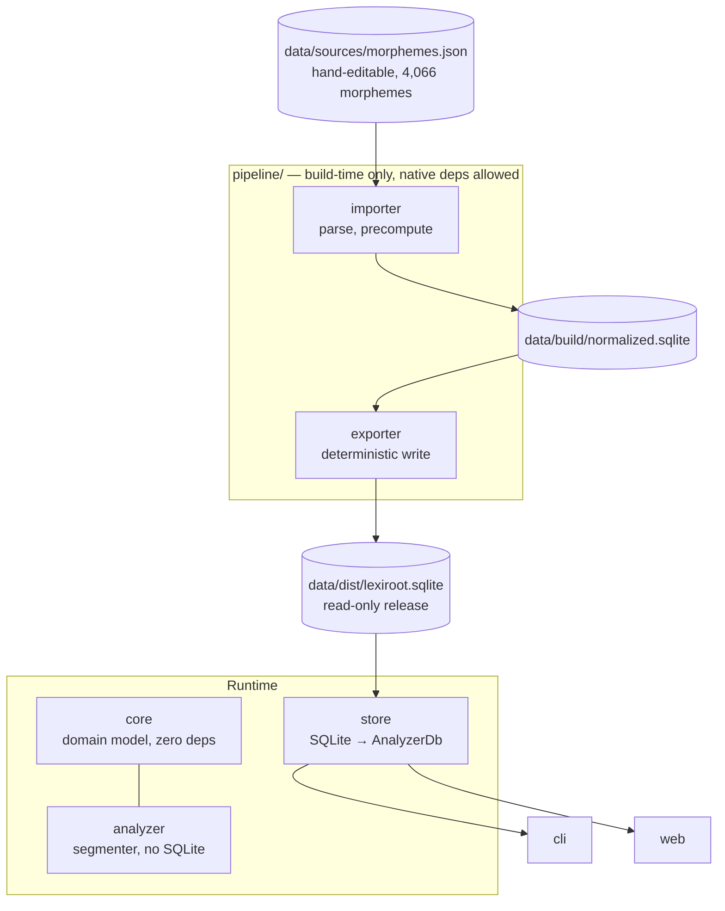

# LexiRoot

> **Understand English from its roots.**
> An open-source, offline morphology engine for English.

[](LICENSE)
[](https://www.rust-lang.org)

LexiRoot decomposes English words into their morphemes — prefix, root, suffix —
and explains *why*, with a confidence score and a source reference on every
answer.

```
$ lexiroot analyze unbelievable

Word: unbelievable  (confidence 0.95)

Prefix:
  un = against, deprive, negate, negation, not, one, opposite, release, reverse, single

Root:
  believe = accept as true, have faith in

Suffix:
  able = able to, fit to, having the quality of, capable of being, worthy

Evidence: source-listed example word, segmented into: un + believe + able, after reversing silent-e deletion at the root boundary
```

Note the root: the word spells it `believ`, but the answer names the canonical
morpheme `believe` and says which spelling rule it had to undo to get there.
That is the whole point of the project — not just splitting a string, but
producing an analysis you can check.

---

## Status

**v0.1 — first working milestone.** The pipeline, the segmenter, the release
database, the CLI and a local web UI all work end to end.

What ships today:

| | |
|---|---|
| Morphemes in the release database | **4,066** |
| Precomputed word decompositions | **10,649** |
| Release database size | **3.4 MB** |
| Hand-checked regression cases | **61** passing, 4 documented gaps |
| Coverage on the 209k-word system dictionary | **43.5%** |

Word decomposition, root lookup and word-family listing are implemented.
**Etymology tracing, relationship-graph traversal, FFI and WebAssembly
bindings are not** — see [Roadmap](#roadmap). Earlier drafts of this document
described them as if they existed; they were design intent, not code.

---

## Why

Most dictionaries tell you what a word means. LexiRoot tells you how it is
built:

- Why is **inspection** spelled this way?
- Which words share the root of **spect**?
- What does **trans-** contribute to **transportation**?
- Which words belong to the same family?

It is designed to be embedded — a Rust library plus a read-only SQLite file,
no network, no service to call.

| Traditional dictionary | LexiRoot |
|---|---|
| Defines words | Explains how words are built |
| Lookup by word | Lookup by word, root, or affix |
| Flat entries | Morpheme table + decomposition table |
| Online service | Offline-first embeddable library |
| Opaque answers | Confidence + evidence + source on every record |

---

## Quick start

Requires a recent stable Rust toolchain (2024 edition). SQLite is vendored via
`rusqlite`'s `bundled` feature — nothing to install.

```bash
git clone https://github.com/tcyeee/lexiroot
cd lexiroot
cargo build --release
```

The release database is committed at `data/dist/lexiroot.sqlite`, so the CLI
works immediately.

### CLI

```bash
./target/release/lexiroot analyze inspection
./target/release/lexiroot root spect
./target/release/lexiroot family port
```

```
$ lexiroot family port
port
├── apportion
├── comport
├── comportment
├── deport
├── export
├── import
├── manuport
├── port
├── portable
├── portage
├── portion
├── proportion
├── purport
├── rapport
├── report
├── support
└── transport
```

Point at a different database with `--db <path>`.

### Local web UI

`crates/web` loads the release database into memory and serves a page for
trying queries interactively.

```bash
cargo run -p lexiroot-web
# LexiRoot test page: http://127.0.0.1:8080  (db: data/dist/lexiroot.sqlite)
```

Options: `--db <path>`, `--host <addr>`, `--port <port>`. Query state lives in
the URL (`?mode=analyze&q=inspection`), so a result can be shared or reloaded.

The same three endpoints answer JSON directly:

```bash
curl 'http://127.0.0.1:8080/api/analyze?word=inspection'
curl 'http://127.0.0.1:8080/api/root?text=spect'
curl 'http://127.0.0.1:8080/api/family?text=port'
```

> **This is a development tool.** The server uses only `std` (no HTTP
> framework) and binds loopback by default. There is no auth, no rate
> limiting, no TLS. Do not expose it.

### As a library

```rust
use lexiroot_core::RELEASE_DB_PATH;

fn main() -> anyhow::Result<()> {
    let db = lexiroot_store::load(std::path::Path::new(RELEASE_DB_PATH))?;

    if let Some(analysis) = db.analyze("inspection") {
        for segment in &analysis.segments {
            let m = db.get_morpheme(&segment.morpheme_id).unwrap();
            println!("{:>6}  {}  {}", segment.role.as_str(), m.form, m.meanings.join(", "));
        }
        println!("confidence {:.2}", analysis.provenance.confidence());
    }
    Ok(())
}
```

`lexiroot_store::load` reads the whole database into an in-memory `AnalyzerDb`
and verifies its schema version. `lexiroot_analyzer` itself never touches
SQLite — that boundary is what keeps the runtime free of native dependencies.

---

## How it works

### Two tiers, and an honest "no"

`AnalyzerDb::analyze` answers in one of three ways:

| Tier | Path | Source | Confidence |
|---|---|---|---|
| 1 | Exact hit in the precomputed decomposition table | the dataset that listed it | 0.95 |
| 2 | Live segmentation over the morpheme index | `inferred` | 0.50 |
| 3 | No parse scored above the floor | — | `None` |

Tier 3 matters. A scored search always finds *something* for a long word, so
without a floor `unhappiness` would come back as `un + hap + pi + ness`, stated
just as confidently as a correct answer. Refusing to answer is better than
answering wrongly with authority.

### Scoring, not greedy matching

The segmenter enumerates parses of the grammar `prefix* root suffix*` and
scores them. Greedy first-match returns `trans + por + tat + ion` for
*transportation* as readily as `trans + port + ation`; the weights are what
separate them. They penalise affix-only roots, two-character segments, stacked
prefixes and word-final short roots, and reward pushing the root rightward and
matching longer roots.

The weights are tuned against `data/gold/segmentations.tsv` and documented
inline in `crates/analyzer/src/segment.rs`. Change one and run:

```bash
cargo test -p lexiroot-store --test gold
```

### Spelling changes at morpheme boundaries

English rewrites the stem when it attaches an affix: `believe` + `-able` is
`believable`, `happy` + `-ness` is `happiness`, `run` + `-ing` is `running`. A
segmenter that tiles a word with literal substrings finds nothing in any of
them — the letters in the root slot (`believ`, `happi`, `runn`) are not the
letters the morpheme table holds.

LexiRoot splits this by whether a rule can predict the change:

| | Mechanism | Where | Examples |
|---|---|---|---|
| **Regular** | Derived by rule, run backwards | `analyzer::ortho` | silent-e deletion, consonant doubling, `y` → `i` |
| **Irregular** | Listed per morpheme | `Morpheme::variants` | `admit` ~ `admiss`, `receive` ~ `recept`, `in-` ~ `im-`/`il-`/`ir-` |

The split is deliberate. Regular changes are *productive* — they apply to stems
the database has never seen — so listing them per stem would mean three or four
dead rows each and would still miss anything new. Irregular alternation is not
predictable from spelling at all, so it has to be written down.

Segments are always reported under the **canonical** morpheme id, never the
surface spelling, so every id in a decomposition resolves in the morpheme
table.

### Explainability is in the schema

Every `Morpheme` and `WordDecomposition` carries a `Provenance`:

```rust
pub struct Provenance {
    confidence: f32,        // constructor-validated 0.0..=1.0
    pub evidence: String,   // human-readable reason
}
```

It is a required field on the struct, not optional metadata, so an
unexplainable record cannot be constructed.

---

## Data

### The dataset

One hand-editable file — `data/sources/morphemes.json`, 4,066 morphemes — is the
whole input to the pipeline.

```json
"admit": { "positions": ["root"], "meanings": ["let in", "confess"], "examples": ["admission"], "variants": ["admiss"] }
```

It was assembled from three: two third-party Greek/Latin root dictionaries plus
this project's own native-stem list, which the importer used to merge on every
build under a priority order. That merge is now resolved once, at curation time,
and written down — a conflict you can see and overrule beats one adjudicated
implicitly on every build.

| Origin | Supplied | Entries | Morphemes | License |
|---|---|---|---|---|
| [colingoldberg/morphemes](https://github.com/colingoldberg/morphemes) | Greek/Latin bound roots and affixes with meanings and example words | 2,435 | 3,762 | MIT |
| [WithEnglishWeCan/generated-english-roots-list](https://github.com/WithEnglishWeCan/generated-english-roots-list) | Greek/Latin roots | 1,061 | 102 net | MIT |
| ours | Native free stems and irregular allomorphs | 267 | 202 net | — |

The counts differ for different reasons. One `colingoldberg` entry can list
several forms (`Afro-` and `Afro`), so 2,435 entries expanded to 3,762 distinct
morphemes. The second dictionary added only 102 net — the other 959 of its roots
were already covered. And 65 of the 267 curated stems merged into existing
entries, adding a position, examples or variants rather than a new row.

That third group exists because the first two are *bound-root* dictionaries.
They are good at `spect`, `port` and `struct` — forms that never stand alone —
and contain essentially none of the Germanic core of English. The consequence
was total, not partial: `believe`, `help`, `friend` and `break` were all absent,
so nothing built on them could be segmented at all, however good the algorithm.

Records carry no per-source marker. The datasets are fully absorbed, so there is
nothing left for one to distinguish; both upstream datasets are MIT, and keeping
their copyright notices — see [`THIRD_PARTY_NOTICES.md`](THIRD_PARTY_NOTICES.md)
— is the whole of what that requires.

See [`data/README.md`](data/README.md) for the schema and curation rules.

### Adding a source

Every candidate needs its license checked *before* import. The project
distributes as MIT, and none of the obvious next sources are:

| Candidate | The problem |
|---|---|
| Wiktionary | CC BY-SA / GFDL dual-licensed; share-alike is viral and would likely force the whole release database to CC BY-SA |
| MorphoLex | Academic dataset — needs a check for NonCommercial / ShareAlike terms |
| Etymonline | Commercial site, all rights reserved; cannot be bundled without explicit permission |

The rule: if a source's terms would reach the license of the release database,
it does not go into the dataset. An optional runtime download is the fallback if
the data is worth it. Importing a share-alike source would also mean
reintroducing a per-record license marker — with one file and no such source,
there is nothing to mark, so no field is reserved for it in advance.

### Release database

The release file's path is fixed at `data/dist/lexiroot.sqlite` and its version
lives *inside* it, in a `meta` table (`schema_version`, `data_version`). Both
are compile-time constants in `lexiroot-core`, so stamping them keeps the export
byte-reproducible.

A version in the filename would be a constant every producer and consumer had
to repeat, and bumping it would leave the old file on disk for anything that
missed the edit. Instead `store::load` reads `schema_version` and refuses a
database this build cannot read. Published artifacts get their version at
packaging time (`lexiroot-0.2.0.sqlite`) — the one place the number is written
by hand.

---

## Architecture



| Crate | Role | Native deps |
|---|---|---|
| `lexiroot-core` | Domain model: `Morpheme`, `WordDecomposition`, `Provenance`, artifact paths and versions | none |
| `lexiroot-analyzer` | Morpheme index, scored segmenter, orthographic rules, query surface (`AnalyzerDb`) | none |
| `lexiroot-store` | Loads a release SQLite file into an `AnalyzerDb`; checks schema version | rusqlite |
| `lexiroot-cli` | `lexiroot` binary | rusqlite (via store) |
| `lexiroot-web` | Local test page + JSON API, `std`-only HTTP | rusqlite (via store) |
| `lexiroot-pipeline-importer` | Parses the dataset, precomputes decompositions | rusqlite |
| `lexiroot-pipeline-exporter` | Writes the deterministic release database | rusqlite |

`core` and `analyzer` carry **zero** dependencies beyond `serde`/`thiserror`,
which is what will let them cross-compile to `wasm32-unknown-unknown` and
mobile targets. Anything needing a native dependency lives behind `store` or in
`pipeline/`, and the boundary is enforced by the workspace dependency graph
rather than by convention.

### Layout

```text
lexiroot/
├── crates/
│   ├── core/              # domain model + Provenance
│   ├── analyzer/          # segmenter, ortho rules, in-memory query surface
│   ├── store/             # release SQLite → AnalyzerDb
│   ├── cli/               # the `lexiroot` binary
│   ├── web/               # local test page + JSON API (dev tool)
│   └── pipeline/          # build-time only, never linked into runtime
│       ├── importer/      # sources → normalized.sqlite
│       └── exporter/      # normalized.sqlite → release
└── data/
    ├── sources/           # morphemes.json — the curated dataset
    ├── gold/              # hand-checked segmentations; the regression set
    ├── build/             # intermediate normalized.sqlite (gitignored)
    └── dist/              # lexiroot.sqlite — read-only release
```

Each of the three artifact paths — the dataset, the build database, the release
database — is a single constant in `lexiroot-core` (`DATASET_PATH`,
`BUILD_DB_PATH`, `RELEASE_DB_PATH`), never spelled out at both the producing and
consuming end.

---

## Development

### Rebuilding the database

```bash
cargo run -p lexiroot-pipeline-importer    # data/sources/morphemes.json → data/build/normalized.sqlite
cargo run -p lexiroot-pipeline-exporter    # → data/dist/lexiroot.sqlite
```

The importer prints a summary:

```
wrote data/build/normalized.sqlite
  morphemes:                          4066
  cross-source duplicates skipped:     959
  curated stems added:                 202
  curated stems merged into existing:  65
  morphemes carrying variants:         4
  example words seen:                 17137
  precomputed decompositions:         10649
  skipped (no full segmentation):      6488
```

That last line is the honest measure of where the engine stands: of 17,137
example words the sources list, 6,488 could not be fully segmented and were
dropped rather than stored as partial guesses.

The exporter is deterministic — the same input produces a byte-identical file,
which is why `meta` holds only compile-time constants and no build timestamp.

### Tests

```bash
cargo test --workspace
```

The regression set that matters is `data/gold/segmentations.tsv` — 61
hand-checked segmentations, run by `cargo test -p lexiroot-store --test gold`.
It is deliberately *not* derived from the precomputed decomposition table,
which is itself produced by running the segmenter over the sources' example
words; scoring against that would only measure the segmenter's agreement with
itself.

The file also records 4 `GAP` entries — words this pass is known not to handle,
each with its cause in a trailing comment (`helpers`: inflection unhandled;
`rebuilt`, `unspoken`: ablaut; `deception`: variant loses to a junk parse). A
second test asserts they still fail, so closing a gap is a visible event rather
than a silent one.

### Coverage

```bash
cargo run --release -p lexiroot-store --example coverage -- /usr/share/dict/words
# 91026/209484 = 43.5%
```

This measures whether a word gets *an* analysis, not whether it is correct —
use the gold set for that.

---

## Roadmap

**v0.1 — done.** Morpheme database, scored segmenter, spelling rules,
confidence and provenance, SQLite pipeline, CLI, local web UI.

**v0.2 — quality and reach.** Raise coverage and gold-set size; inflectional
handling (`helpers`, `running`); ablaut variants (`speak` ~ `spoke`); expand
the curated native stems across the Germanic core; publish crates to crates.io.

**v0.3 — relationships.** Word-family and etymology graphs as real data rather
than a by-product of the precomputed table; graph traversal as SQL recursive
queries against the release file, so mobile memory stays flat.

**v0.4 — bindings.** `ffi` crate for iOS/Android/Flutter; separate `wasm` crate
for the browser; incremental database updates.

**v1.0 — stable.** Frozen Rust API, quantified performance targets (query
latency, binary size, database size), complete documentation.

### Known open questions

- **Target user is not converged.** Dictionary apps, AI assistants, exam-prep
  tools and NLP pipelines want quite different things. One concrete seed user
  would be worth more than the next three features.
- **No quantified performance targets.** "Fast" and "embeddable" are still
  adjectives here, not numbers.
- **No competitive comparison** against Datamuse, WordNet or Morfessor.

---

## Contributing

Useful contributions, roughly in order of value:

1. **Add gold cases.** `data/gold/segmentations.tsv` is the only thing keeping
   the scoring weights honest. Wrong output you can document is a real
   contribution.
2. **Extend `data/sources/morphemes.json`.** Read the curation rules in
   [`data/README.md`](data/README.md) first — in particular, do not list
   spelling changes a rule already predicts, and check any addition against the
   gold set before opening a PR.
3. **Close a documented `GAP`.** Promote the entry out of the GAP section in
   the same change.

Run `cargo test --workspace` before submitting. If you change scoring weights,
say what the gold set did in the PR description.

---

## Acknowledgements

LexiRoot's morpheme data started from these open-source projects. They saved
the work of hand-compiling thousands of roots from scratch and are the reason
the first working loop took weeks rather than months. The data has since been
modified and extended for the segmenter's needs.

| Project | Contributed | License |
|---|---|---|
| [colingoldberg/morphemes](https://github.com/colingoldberg/morphemes) | 2,435 prefix / root / suffix entries with meanings and example words | MIT |
| [WithEnglishWeCan/generated-english-roots-list](https://github.com/WithEnglishWeCan/generated-english-roots-list) | 1,061 Greek/Latin roots | MIT |

Full license texts are in [`THIRD_PARTY_NOTICES.md`](THIRD_PARTY_NOTICES.md);
per-dataset origins and modifications are in [`data/README.md`](data/README.md).

---

## License

Code and data are released under the MIT License — see [`LICENSE`](LICENSE).

Datasets under `data/sources/` derive from the two MIT projects above and have
been modified by this project; the original copyright notices are preserved in
[`THIRD_PARTY_NOTICES.md`](THIRD_PARTY_NOTICES.md).

---

中文文档见 [README.zh.md](README.zh.md)。
