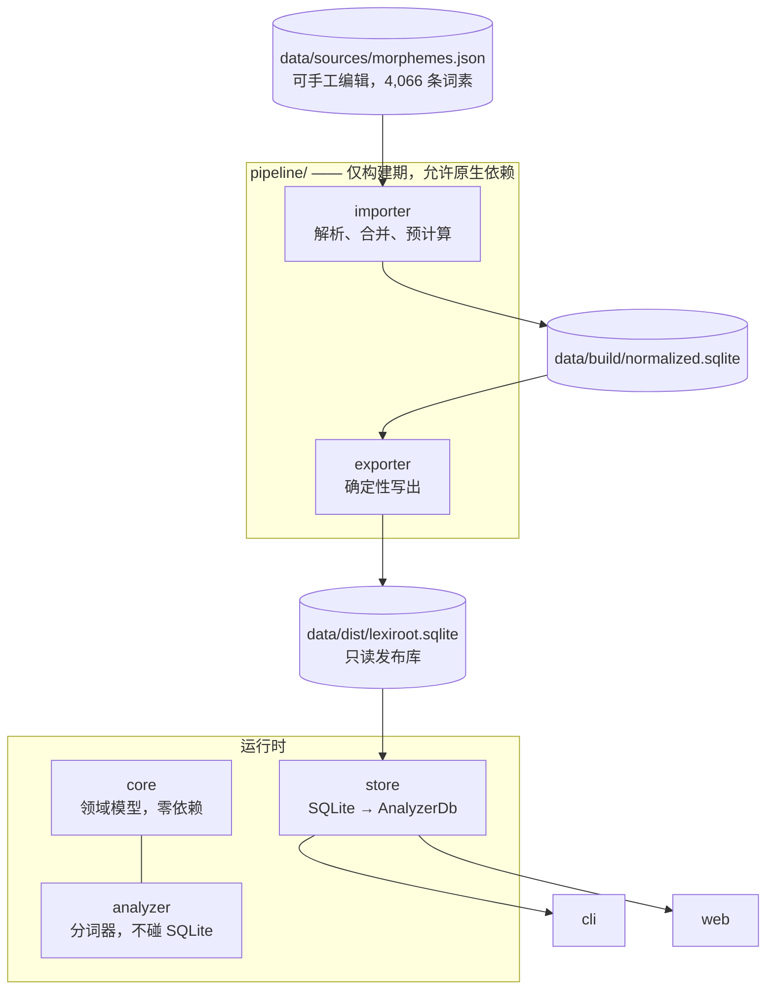

# LexiRoot

> **从词根理解英语。**
> 开源、离线的英语构词法分析引擎。

[](LICENSE)
[](https://www.rust-lang.org)

LexiRoot 把英语单词拆解成词素——前缀、词根、后缀——并解释**为什么**这样拆：每个
答案都带置信度和数据来源。

```
$ lexiroot analyze unbelievable

Word: unbelievable  (confidence 0.95)

Prefix:
  un = against, deprive, negate, negation, not, one, opposite, release, reverse, single

Root:
  believe = accept as true, have faith in

Suffix:
  able = able to, fit to, having the quality of, capable of being, worthy

Evidence: source-listed example word, segmented into: un + believe + able, after reversing silent-e deletion at the root boundary
```

注意词根这一行：单词里写的是 `believ`，但结果给出的是规范词素 `believe`，并说明为了
得到它反推了哪条拼写规则。这正是本项目的重点——不只是切分字符串，而是给出一个**可以
核对**的分析。

---

## 项目状态

**v0.1——第一个可用的里程碑版本。** 流水线、分词器、发布库、CLI 和本地网页端已经完整
跑通。

当前交付：

| | |
|---|---|
| 发布库中的词素 | **4,066** 条 |
| 预计算的词分解 | **10,649** 条 |
| 发布库体积 | **3.4 MB** |
| 人工核对的回归用例 | **61** 条通过，4 条已记录的缺口 |
| 20.9 万词系统词典上的覆盖率 | **43.5%** |

已实现：词分解、词根查询、词族列表。
**词源追溯、关系图遍历、FFI 与 WebAssembly 绑定尚未实现**——见[路线图](#路线图)。
本文档早期版本把它们写得像已经存在，那是设计意图，不是代码。

---

## 为什么做这个

大多数词典告诉你一个词是什么意思，LexiRoot 告诉你它是怎么造出来的：

- **inspection** 为什么这样拼？
- 哪些词和 **spect** 同根？
- **trans-** 在 **transportation** 里贡献了什么？
- 哪些词属于同一个词族？

它的定位是**被嵌入**——一个 Rust 库加一个只读 SQLite 文件，不联网，不需要调服务。

| 传统词典 | LexiRoot |
|---|---|
| 定义单词 | 解释单词如何构成 |
| 按词查 | 按词、词根、词缀查 |
| 扁平词条 | 词素表 + 分解表 |
| 在线服务 | 离线优先的嵌入式库 |
| 结果不可解释 | 每条记录都带置信度、证据、来源 |

---

## 快速开始

需要较新的 Rust stable 工具链（2024 edition）。SQLite 通过 `rusqlite` 的 `bundled`
特性内置，无需另外安装。

```bash
git clone https://github.com/tcyeee/lexiroot
cd lexiroot
cargo build --release
```

发布库 `data/dist/lexiroot.sqlite` 已随仓库提交，CLI 可以直接使用。

### 命令行

```bash
./target/release/lexiroot analyze inspection
./target/release/lexiroot root spect
./target/release/lexiroot family port
```

```
$ lexiroot family port
port
├── apportion
├── comport
├── comportment
├── deport
├── export
├── import
├── manuport
├── port
├── portable
├── portage
├── portion
├── proportion
├── purport
├── rapport
├── report
├── support
└── transport
```

用 `--db <path>` 指定其他数据库。

### 本地网页端

`crates/web` 把发布库加载进内存，起一个网页用来交互式试查询。

```bash
cargo run -p lexiroot-web
# LexiRoot test page: http://127.0.0.1:8080  (db: data/dist/lexiroot.sqlite)
```

可选参数：`--db <path>`、`--host <addr>`、`--port <port>`。查询状态写进 URL
（`?mode=analyze&q=inspection`），可以直接分享或刷新复现。

同样的三个接口也可以直接返回 JSON：

```bash
curl 'http://127.0.0.1:8080/api/analyze?word=inspection'
curl 'http://127.0.0.1:8080/api/root?text=spect'
curl 'http://127.0.0.1:8080/api/family?text=port'
```

> **这是开发工具。** 服务端只用 `std`（没有 HTTP 框架依赖），默认只监听 loopback。
> 没有鉴权、限流和 TLS，不要对外暴露。

### 作为库使用

```rust
use lexiroot_core::RELEASE_DB_PATH;

fn main() -> anyhow::Result<()> {
    let db = lexiroot_store::load(std::path::Path::new(RELEASE_DB_PATH))?;

    if let Some(analysis) = db.analyze("inspection") {
        for segment in &analysis.segments {
            let m = db.get_morpheme(&segment.morpheme_id).unwrap();
            println!("{:>6}  {}  {}", segment.role.as_str(), m.form, m.meanings.join(", "));
        }
        println!("confidence {:.2}", analysis.provenance.confidence());
    }
    Ok(())
}
```

`lexiroot_store::load` 把整个数据库读进内存的 `AnalyzerDb`，并校验 schema 版本。
`lexiroot_analyzer` 本身完全不碰 SQLite——正是这条边界让运行时保持零原生依赖。

---

## 工作原理

### 两层查询，以及诚实的「查不到」

`AnalyzerDb::analyze` 有三种应答：

| 层级 | 路径 | 来源 | 置信度 |
|---|---|---|---|
| 1 | 命中预计算的分解表 | 收录它的那个数据集 | 0.95 |
| 2 | 在词素索引上实时分词 | `inferred` | 0.50 |
| 3 | 没有任何解析超过分数下限 | — | `None` |

第三层很重要。带打分的搜索对长词**总能**找出点什么，所以没有下限的话，`unhappiness`
会被切成 `un + hap + pi + ness`，而且和正确答案一样理直气壮。拒绝作答好过用权威的
口吻给出错误答案。

### 打分，而不是贪心匹配

分词器按 `prefix* root suffix*` 的构词语法枚举所有解析并打分。贪心的首个匹配对
*transportation* 给出 `trans + por + tat + ion` 的概率不比 `trans + port + ation`
低，是权重把它们区分开的。权重惩罚「只在词缀位置出现过的词根」、两字符片段、堆叠前缀
和词尾短词根，奖励把词根往右推、以及匹配到更长的词根。

权重针对 `data/gold/segmentations.tsv` 调过，理由都写在
`crates/analyzer/src/segment.rs` 的注释里。改动任何一个之后跑：

```bash
cargo test -p lexiroot-store --test gold
```

### 词素边界上的拼写变化

英语在加词缀时会改写词干：`believe` + `-able` → `believable`，`happy` + `-ness` →
`happiness`，`run` + `-ing` → `running`。用字面子串去拼接单词的分词器在这些词上一个
都找不到——词根槽里的字母（`believ`、`happi`、`runn`）不是词素表里的那些字母。

LexiRoot 按「规则能否预测这个变化」把它拆成两条路径：

| | 机制 | 位置 | 例子 |
|---|---|---|---|
| **规则性** | 由规则反推 | `analyzer::ortho` | 去哑音 e、辅音双写、`y` → `i` |
| **不规则** | 逐条列在词素上 | `Morpheme::variants` | `admit` ~ `admiss`、`receive` ~ `recept`、`in-` ~ `im-`/`il-`/`ir-` |

这个划分是刻意的。规则性变化是**能产的**——它们适用于数据库从未收录过的词干——所以
逐词干枚举意味着每个词干多出三四行无效数据，而且照样漏掉新情况。不规则交替则完全无法
从拼写推导，只能写下来。

分解结果里的片段一律用**规范**词素 id，不用表层拼写，所以每个 id 都能在词素表里查到。

### 可解释性写进了 schema

每条 `Morpheme` 和 `WordDecomposition` 都带一个 `Provenance`：

```rust
pub struct Provenance {
    confidence: f32,        // 构造时校验，0.0..=1.0
    pub evidence: String,   // 人类可读的理由
}
```

它是结构体上的必填字段，不是可选的附加元数据——构造不出一条无法解释的记录。

---

## 数据

### 数据集

一个可手工编辑的文件——`data/sources/morphemes.json`，4,066 条词素——是整条流水线
唯一的输入。

```json
"admit": { "positions": ["root"], "meanings": ["let in", "confess"], "examples": ["admission"], "variants": ["admiss"] }
```

它由三份数据合成：两部第三方希腊语/拉丁语词根词典，加上本项目原创的原生词干表。
过去 importer 在每次构建时按优先级合并它们，现在这个合并在策展时解决一次并写下来
——冲突看得见、可以推翻，好过每次构建被优先级规则隐式裁决。

| 出处 | 提供了什么 | 条目 | 词素 | 许可证 |
|---|---|---|---|---|
| [colingoldberg/morphemes](https://github.com/colingoldberg/morphemes) | 带词义和例词的希腊语/拉丁语黏着词根与词缀 | 2,435 | 3,762 | MIT |
| [WithEnglishWeCan/generated-english-roots-list](https://github.com/WithEnglishWeCan/generated-english-roots-list) | 希腊语/拉丁语词根 | 1,061 | 净增 102 | MIT |
| 本项目原创 | 英语原生自由词干 + 不规则异形 | 267 | 净增 202 | — |

数字对不上的原因各不相同。`colingoldberg` 的一个条目可以列多个形式（`Afro-` 和
`Afro`），所以 2,435 个条目展开成 3,762 个不同词素。第二部词典只净增 102 条，因为
它另外 959 条词根已经被覆盖。而 267 条策展词干里有 65 条是合并进已有条目（补一个
位置、几个例词或异形），不是新增。

第三部分之所以存在，是因为前两个都是**黏着词根**词典。它们擅长 `spect`、`port`、
`struct` 这类不能独立成词的形式，而英语原生的日耳曼语核心几乎完全不在其中。后果是
全面的而非局部的：`believe`、`help`、`friend`、`break` 全都缺失，任何基于它们构成的
词都无法分词——算法再好也没用。

条目**不带来源标记**。三份数据已经完全融入，没有什么需要区分；两个上游数据集是 MIT，
保留其版权声明（见 [`THIRD_PARTY_NOTICES.md`](THIRD_PARTY_NOTICES.md)）就是它要求的
全部。

格式与策展规则见 [`data/README.md`](data/README.md)。

### 新增数据源

**每一个候选源都必须先确认许可证再导入。** 项目整体以 MIT 分发，而下面这些明显的
下一批候选没有一个是 MIT：

| 候选源 | 问题所在 |
|---|---|
| Wiktionary | CC BY-SA / GFDL 双重授权，share-alike 有传染性，很可能迫使整个发布库改用 CC BY-SA |
| MorphoLex | 学术数据集，需确认是否带 NonCommercial / ShareAlike 限制 |
| Etymonline | 商业站点内容，默认全部权利保留，没有明确授权就不能打包分发 |

判断标准：只要某个源的条款会波及发布库的授权，就不进数据集。如果数据确实值得要，
退路是改成运行时可选下载。引入传染性授权的源还意味着要重新引入逐条的授权标记——
现在只有一个文件、也没有这类源，所以不预留这个字段。

### 发布库

发布文件的路径固定为 `data/dist/lexiroot.sqlite`，版本号写在库**内部**的 `meta` 表
里（`schema_version`、`data_version`）。两者都是 `lexiroot-core` 里的编译期常量，所以
写入它们不会破坏导出的逐字节可复现性。

版本号如果放在文件名里，就变成一个每个生产者和消费者都要重复一遍的常量，升版时旧文件
还留在目录里，漏改的那一处会静默读到陈旧的库。改成路径恒定之后，`store::load` 从
`meta` 读 `schema_version`，读不动就直接报错。对外分发时才在打包环节命名成
`lexiroot-0.2.0.sqlite`——版本号只在那一处手写。

---

## 架构



| Crate | 职责 | 原生依赖 |
|---|---|---|
| `lexiroot-core` | 领域模型：`Morpheme`、`WordDecomposition`、`Provenance`，以及制品路径与版本常量 | 无 |
| `lexiroot-analyzer` | 词素索引、带打分的分词器、拼写规则、查询接口（`AnalyzerDb`） | 无 |
| `lexiroot-store` | 把发布库加载成 `AnalyzerDb`，校验 schema 版本 | rusqlite |
| `lexiroot-cli` | `lexiroot` 可执行文件 | rusqlite（经 store） |
| `lexiroot-web` | 本地测试页 + JSON API，纯 `std` HTTP | rusqlite（经 store） |
| `lexiroot-pipeline-importer` | 解析各源、按 form 合并、预计算分解 | rusqlite |
| `lexiroot-pipeline-exporter` | 写出确定性的发布库 | rusqlite |

`core` 和 `analyzer` 除 `serde`/`thiserror` 外**零依赖**，这是它们将来能干净地交叉编译到
`wasm32-unknown-unknown` 和移动端目标的前提。任何需要原生依赖的东西都躲在 `store`
之后或 `pipeline/` 里，这条边界由 workspace 依赖图强制，而不只是约定。

### 目录结构

```text
lexiroot/
├── crates/
│   ├── core/              # 领域模型 + Provenance
│   ├── analyzer/          # 分词器、拼写规则、内存查询接口
│   ├── store/             # 发布库 SQLite → AnalyzerDb
│   ├── cli/               # lexiroot 命令行
│   ├── web/               # 本地测试页 + JSON API（开发工具）
│   └── pipeline/          # 仅构建期，绝不链接进运行时
│       ├── importer/      # sources → normalized.sqlite
│       └── exporter/      # normalized.sqlite → 发布库
└── data/
    ├── sources/           # morphemes.json —— 策展数据集
    ├── gold/              # 人工核对的分词结果，回归集
    ├── build/             # 中间产物 normalized.sqlite（gitignored）
    └── dist/              # lexiroot.sqlite —— 只读发布库
```

三个制品路径——数据集、构建库、发布库——在 `lexiroot-core` 里各有一个常量
（`DATASET_PATH` / `BUILD_DB_PATH` / `RELEASE_DB_PATH`），不在生产端和消费端各写一遍。


---

## 开发

### 重建数据库

```bash
cargo run -p lexiroot-pipeline-importer    # data/sources/morphemes.json → data/build/normalized.sqlite
cargo run -p lexiroot-pipeline-exporter    # → data/dist/lexiroot.sqlite
```

importer 会打印一份摘要：

```
wrote data/build/normalized.sqlite
  morphemes:                          4066
  cross-source duplicates skipped:     959
  curated stems added:                 202
  curated stems merged into existing:  65
  morphemes carrying variants:         4
  example words seen:                 17137
  precomputed decompositions:         10649
  skipped (no full segmentation):      6488
```

最后一行是对引擎当前水平最诚实的度量：各源列出的 17,137 个例词里，有 6,488 个无法被
完整分词，它们被丢弃而不是当作局部猜测存下来。

exporter 是确定性的：同样的输入产出逐字节相同的文件——这也是 `meta` 里只写编译期常量、
不写构建时间戳的原因。

### 测试

```bash
cargo test --workspace
```

真正重要的回归集是 `data/gold/segmentations.tsv`——61 条人工核对的分词结果，由
`cargo test -p lexiroot-store --test gold` 执行。它**刻意不**从预计算分解表派生：那张表
本身就是用分词器跑各源例词生成的，拿它当基准只能测出分词器和自己的一致性。

文件里另外记录了 4 条 `GAP`——本轮已知处理不了的词，每条在行尾注明原因（`helpers`：
未处理屈折；`rebuilt`、`unspoken`：元音交替；`deception`：变体形式输给了垃圾解析）。
另一个测试断言它们仍然失败，所以补上一个缺口是一件看得见的事，而不是悄悄发生的。

### 覆盖率

```bash
cargo run --release -p lexiroot-store --example coverage -- /usr/share/dict/words
# 91026/209484 = 43.5%
```

这只衡量一个词能否得到**某个**分析，不衡量分析是否正确——后者用 gold 集。

---

## 路线图

**v0.1 —— 已完成。** 词素数据库、带打分的分词器、拼写规则、置信度与来源、SQLite 流水线、
CLI、本地网页端。

**v0.2 —— 质量与广度。** 提高覆盖率、扩充 gold 集；处理屈折（`helpers`、`running`）；
处理元音交替（`speak` ~ `spoke`）；把策展的原生词干扩展到整个日耳曼语核心；发布到
crates.io。

**v0.3 —— 关系。** 把词族图和词源图做成真实数据，而不是预计算表的副产品；图遍历用对
发布库跑 SQL 递归查询实现，让移动端内存占用保持平坦。

**v0.4 —— 绑定。** iOS/Android/Flutter 的 `ffi` crate；浏览器端独立的 `wasm` crate；
数据库增量更新。

**v1.0 —— 稳定。** 冻结 Rust API、量化性能指标（查询延迟、二进制体积、库体积）、完整
文档。

### 尚未解决的问题

- **目标用户没有收敛。** 词典 App、AI 助手、备考工具、NLP 流水线想要的东西差别很大。
  找到一个具体的种子用户，价值高于再做三个功能。
- **没有量化的性能目标。** 「快」和「可嵌入」目前还只是形容词，不是数字。
- **缺竞品对比**——Datamuse、WordNet、Morfessor 都还没比过。

---

## 参与贡献

按价值从高到低：

1. **补 gold 用例。** `data/gold/segmentations.tsv` 是唯一约束打分权重的东西。能被
   记录下来的错误输出本身就是有效贡献。
2. **扩充 `data/sources/morphemes.json`。** 先读 [`data/README.md`](data/README.md)
   里的策展规则——尤其是：规则已经能预测的拼写变化不要写进来；新增条目提 PR 前先对着
   gold 集检查。
3. **补上一个已记录的 `GAP`。** 同一个改动里把该条目移出 GAP 区。

提交前跑 `cargo test --workspace`。如果改了打分权重，在 PR 描述里说明 gold 集的变化。

---

## 致谢

LexiRoot 的词素数据以下面这些开源项目为起点。它们省下了从零手工整理数千条词根的工作量，
让最小闭环得以在几周内跑通而不是几个月。数据在本项目中经过修改和扩充，以适配分词器的
需要。

| 项目 | 提供了什么 | 许可证 |
|---|---|---|
| [colingoldberg/morphemes](https://github.com/colingoldberg/morphemes) | 2,435 条带词义和例词的前缀 / 词根 / 后缀 | MIT |
| [WithEnglishWeCan/generated-english-roots-list](https://github.com/WithEnglishWeCan/generated-english-roots-list) | 1,061 条希腊语 / 拉丁语词根 | MIT |

完整许可证文本见 [`THIRD_PARTY_NOTICES.md`](THIRD_PARTY_NOTICES.md)，各数据集的出处和
修改说明见 [`data/README.md`](data/README.md)。

---

## 许可证

代码与数据均以 MIT 许可证发布，见 [`LICENSE`](LICENSE)。

`data/sources/` 下的数据集以上述两个 MIT 项目为起点并经本项目修改，原始版权声明保留在
[`THIRD_PARTY_NOTICES.md`](THIRD_PARTY_NOTICES.md)。

---

English documentation: [README.md](README.md).
